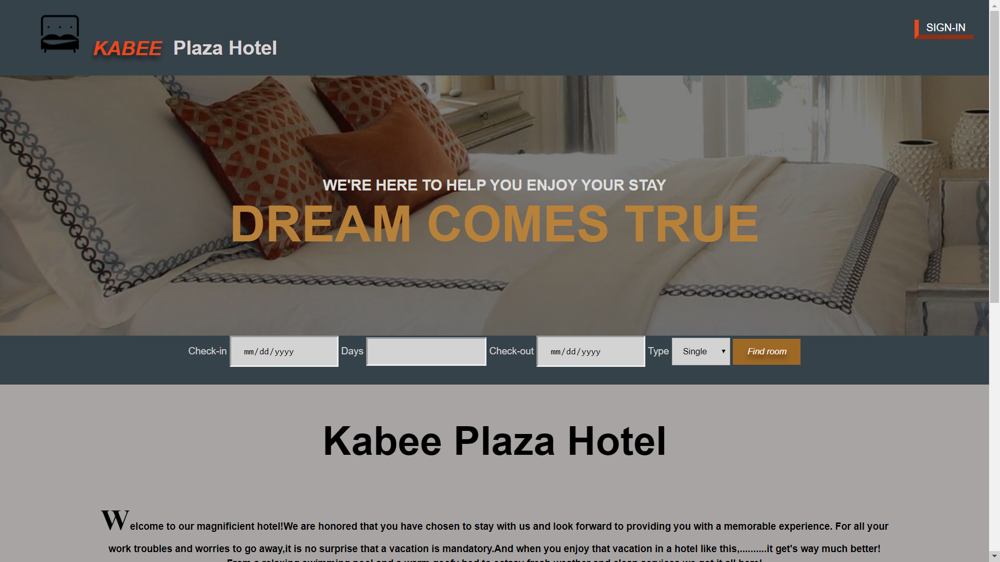

<h1>Khotel</h1>
        
A mini reservation webapp for hotel room resevation

        

        
The app needs environment variables(those on config/custom-environment-variables)
           to be set.variable for database has a default but others don't.
           appID and secretKey are your facebook app-id and secret.
           Set them <b><i>to enable facebook
               login/register button.</i>
        </b> 
            The third("sessionSecret") is for 
            session-cookie secret. 

       
    
